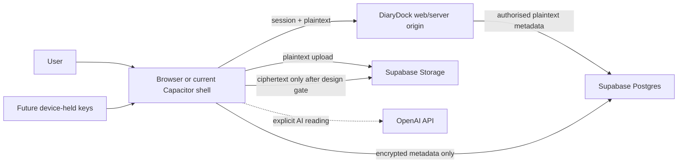

# DiaryDock Vault E2EE threat model

Status: design gate; no DiaryDock content is currently end-to-end encrypted.

Scope: the current All Files/Vault document path and a future versioned encrypted-object Vault. This model does not grant new access or approve an implementation library.

## Overview

DiaryDock currently uploads plaintext from the browser directly to a private Supabase bucket after checking the signed-in user, then stores plaintext searchable metadata and extracted text in `documents` and private application state. Files are opened with short-lived signed URLs. The `/vault` route redirects to the same All Files workspace; there is not a separate cryptographic Vault boundary or runtime Vault resource class. Ordinary document sharing can therefore apply to a file reached through `/vault` when its owner explicitly changes that document's visibility (`lib/document-storage.ts:17-40`, `components/VaultWorkspace.tsx:270-330`, `app/vault/page.tsx:1-9`, `app/files/page.tsx:1-18`).

The server bootstrap returns authorised document rows, including storage location and extracted text, to the browser. Supabase RLS and storage policies are the current confidentiality boundary, not client-held encryption keys (`app/api/diarydock/bootstrap/route.ts:75-100`, `app/api/diarydock/bootstrap/route.ts:184-213`, `supabase/migrations/20260831120000_household_resource_sharing.sql:383-420`). Settings correctly state that E2EE is not enabled (`lib/diarydock-data.ts:366-385`).

| Component | Current role | Security-relevant source |
|---|---|---|
| Web/Capacitor client | Authenticates, uploads plaintext, renders plaintext metadata and requests file links | `lib/supabase/client.ts:1-28`, `lib/document-storage.ts:17-64` |
| Next.js server | Loads authorised plaintext metadata/state and serves remote application code | `app/api/diarydock/bootstrap/route.ts:45-105`, `next.config.ts:11-20` |
| Supabase Auth/Postgres/Storage | Holds sessions, plaintext metadata and server-decryptable files; enforces RLS/private bucket policy | `supabase/schema.sql:1-34`, `supabase/schema.sql:37-123` |
| OpenAI integrations | May receive user-submitted plaintext for explicitly chosen AI reading; not part of an E2EE path | `app/privacy/page.tsx:40-53`, `lib/ask/openai.ts:19-34` |
| Capacitor shell | Loads the production web origin; it is not presently an independently bundled trusted cryptographic client | `capacitor.config.ts:3-14` |

### Effective resources and trust

| Deployment or workflow | Resource or capability | Configuration and precedence | Safe effective value or location | Readers/writers or recipients | Enforcing control | Evidence or unknowns |
|---|---|---|---|---|---|---|
| Production web | Authentication session | Supabase SSR browser/server clients | Http/cookie-backed Supabase session; literal tokens not documented here | Browser, DiaryDock server, Supabase Auth | Supabase Auth and route `getUser()` checks | `lib/supabase/client.ts:19-27`, `lib/supabase/server.ts:11-27` |
| Document upload | File bytes | Private bucket, owner path, 4 MB/type allow-list | `diarydock-documents/<user>/<document>/<name>` | User browser, Supabase Storage, authorised signed-link readers | Storage RLS and bucket constraints | `lib/document-storage.ts:17-40`, `supabase/schema.sql:37-91` |
| Metadata/bootstrap | Titles, extraction, OCR, routes | Authorised `documents` query and private/no-store response | Postgres `documents`; client memory | Authorised user browser and server | Database RLS | `app/api/diarydock/bootstrap/route.ts:75-100`, `app/api/diarydock/bootstrap/route.ts:184-240` |
| Unconfigured/local fallback | Complete app state | Used only when Supabase is not configured | Browser `sessionStorage` | Same-origin scripts and user session | Browser origin/process isolation | `lib/diarydock-data.ts:896-925`, `lib/diarydock-data.ts:1033-1035` |
| Current Android/iOS shell | Executable web client | Remote production URL wins | `https://diarydock.com` | App webview receives server-delivered JavaScript | TLS; no native key-store boundary is implemented | `capacitor.config.ts:3-14` |
| Android share import | Temporary incoming file | Android app-private cache and bridge | Plaintext cache file until successful import/cleanup | DiaryDock Android process and hosted WebView | OS application sandbox, type/size limits and explicit cleanup | `android/app/src/main/java/com/diarydock/app/DiaryDockShareImportPlugin.java:152-170`, `components/ShareImportWorkspace.tsx:194-265` |
| Future E2EE pilot | Master key, device keys, recovery material | Not implemented; design below required | Trusted device memory/key store; server receives only wrapped keys | Enrolled devices and holder of offline recovery material | Reviewed AEAD/KDF and signed-client controls | Library, native secure storage and device enrolment require approval |

## Threat model, boundaries and assumptions

### Protected assets

- Vault file plaintext, titles, filenames, tags, extracted text and relationships.
- Vault master key, per-object data-encryption keys, device private keys and recovery key.
- Integrity and version of encrypted objects, manifests and key envelopes.
- User authentication and explicit decisions to decrypt, export, share, use AI or recover.
- Availability: users must understand when loss of all key material makes data unrecoverable.

### Actors and realistic starting capabilities

- An unauthenticated internet attacker can send requests and supply uploaded content but does not begin with a valid session.
- A malicious or removed household member or trusted contact may retain their own account and previously received plaintext, but does not begin with the owner's Vault keys.
- A database/storage attacker may read or alter server-held rows/objects but does not begin with device-held key material in the target model.
- A compromised DiaryDock server or deployment account can alter remote web JavaScript. In the current web and remote-URL Capacitor model this actor can potentially capture keys when a user next decrypts; therefore the strongest “DiaryDock server cannot decrypt” claim is not supportable without an independently signed client.
- A device attacker with an unlocked device or same-origin script execution may read in-memory plaintext and keys. E2EE does not protect an already compromised trusted endpoint.
- A local attacker who controls the DiaryDock Android process or an unlocked/compromised device may reach temporary plaintext share-import cache files. A normal sandboxed app does not begin with this access.
- DiaryDock support is not assumed to possess recovery keys and must not promise recovery when all enrolled devices and offline recovery material are lost.

### Security objectives and invariants

1. The server, database, object store, logs, backups and analytics receive ciphertext and deliberately minimal clear metadata for E2EE objects.
2. Every encrypted object uses authenticated encryption with unique nonces and version-bound associated data; rollback, truncation and object swapping are detected.
3. Raw master/data/device/recovery keys never enter server logs, app state, analytics, URLs or normal browser storage.
4. Account-password changes do not destroy Vault access, and Supabase passwords are never reused directly as encryption keys.
5. Enrolment, recovery, export, E2EE sharing, key rotation and disabling E2EE require explicit user action and recent authentication.
6. Generic household, emergency and Physical Link grants cannot reach encrypted Vault objects.
7. AI reading is disabled for E2EE objects unless the trusted client presents a separate, explicit disclosure that selected plaintext will leave the E2EE boundary.
8. Logout clears plaintext and in-memory keys; persistent offline data remains encrypted. Device revocation blocks future envelopes but cannot erase plaintext already copied.
9. No migration deletes plaintext until ciphertext, metadata, recovery and decrypt-on-another-device checks pass.
10. Product wording distinguishes server-managed private storage, encrypted-at-rest infrastructure and true E2EE.

### Assumptions and unresolved gates

- TLS, Supabase operational controls and OS secure storage are dependencies, not substitutes for E2EE.
- Browser Web Crypto can support an encrypted-at-rest pilot against database/storage compromise, but remote server-delivered JavaScript cannot protect keys from a malicious server build.
- A strong E2EE claim therefore requires an independently distributed/signed native client, reviewed secure-key-store integration, release integrity and a defined policy for the web client.
- Cryptographic library, chunked-file construction, KDF parameters, WebAuthn/secure-enclave portability, accessibility of recovery material and multi-device UX remain approval gates.
- Existing plaintext objects, metadata, OCR and backups remain server-readable until a verified migration completes.

## Attack surface, mitigations and attacker stories

These are threat hypotheses for design coverage, not validated vulnerabilities.

| Priority | Scenario and capability gain | Prerequisites | Impact | Existing controls | Required mitigation | Evidence |
|---|---|---|---|---|---|---|
| Critical | Compromised server ships JavaScript that captures an unlocked Vault key | Deployment/server compromise and user opens Vault | Full future Vault plaintext/key compromise | TLS and account auth do not stop authorised malicious code | Independently signed native crypto client; release provenance; keep keys out of remote web client for strongest mode | `capacitor.config.ts:7-13`, `next.config.ts:16-18` |
| High | Database/storage disclosure reveals current files, OCR and metadata | Provider/admin compromise or policy bypass | Current Vault confidentiality loss | Private bucket, RLS, signed links | Client-side AEAD and encrypted metadata; server stores ciphertext only | `supabase/schema.sql:37-123`, `app/api/diarydock/bootstrap/route.ts:184-213` |
| High | XSS/supply-chain code reads in-memory keys/plaintext | Script execution in trusted origin while Vault unlocked | Decrypt/export owner content | CSP exists, but currently permits inline/eval scripts | Nonce/hash CSP, remove unsafe directives, dependency integrity, short unlock window, native isolation | `next.config.ts:11-20` |
| High | Nonce reuse or unauthenticated chunk ordering breaks confidentiality/integrity | Incorrect custom file-encryption construction | Plaintext recovery or undetected corruption | No E2EE implementation yet | Reviewed library/protocol, versioned manifest, per-chunk nonce derivation and associated-data binding, known-answer tests | Design gate |
| High | Weak/reused recovery secret permits offline key guessing | Low-entropy passphrase or leaked wrapper database | Master-key recovery | No current recovery model | Random high-entropy recovery key; memory-hard KDF only for user passphrases; attempt-independent AEAD verification | Design gate |
| Medium | Removed device/contact retains old content | Prior authorised decrypt or copied key envelope | Continued access to past plaintext | Normal access revocation exists outside E2EE | Rewrap/rotate for future versions; explain that already viewed plaintext cannot be revoked | `lib/resource-access.ts:1-115`, design gate |
| Medium | Server replays an old encrypted version | Server controls object versions | User sees stale instructions or misses deletion | No encrypted version binding | Signed/hash-chained manifest, monotonic client-seen version, explicit conflict UI | Design gate |
| Medium | AI/document processing silently sends decrypted Vault content | Feature integration accepts E2EE object | Third-party plaintext disclosure | Current privacy disclosure for user-chosen AI | Disable by default; per-use disclosure and consent; never background-process encrypted objects | `app/privacy/page.tsx:40-53` |
| Medium | Logout, interruption or crash leaves keys/plaintext in cache, preview or WebView | Persistent client caching or local device/process access | Later local user reads data | Current sign-out ends Supabase session; Android clears staged imports after successful save | Explicit zeroisation/best effort, encrypted cache only, crash/preview cleanup, OS screen protection | `app/login/actions.ts:150-158`, `components/ShareImportWorkspace.tsx:194-265` |
| Low | Ciphertext size/timestamps reveal document patterns | Passive server/storage observer | Metadata inference | Private storage | Padding buckets where justified; document visible metadata inventory; transparent residual-metadata statement | Design gate |

## Severity calibration

- Critical: scalable master-key compromise or a server/release path that can silently extract all users' keys in a product claiming protection from that server. A single already-unlocked compromised endpoint is normally High because the attacker already controls the trusted device boundary.
- High: cross-user plaintext/key disclosure, recovery-key compromise, or cryptographic integrity failure enabling undetected content replacement. A server-readable current document is not itself a new bug because current wording says E2EE is disabled.
- Medium: limited metadata leakage, stale-version replay, future-access revocation gaps, or explicit AI disclosure errors affecting selected items. Severity rises when it crosses users or defeats a stated E2EE guarantee.
- Low: bounded information exposure such as ciphertext length with no plausible plaintext recovery, or hardening gaps requiring control of the user's already-unlocked endpoint.

Repository reviewed: `SimplyLogged` at `2359e4adb014afde64ffd3fece2197c55c185ba9` (model will be refreshed when implementation begins).
